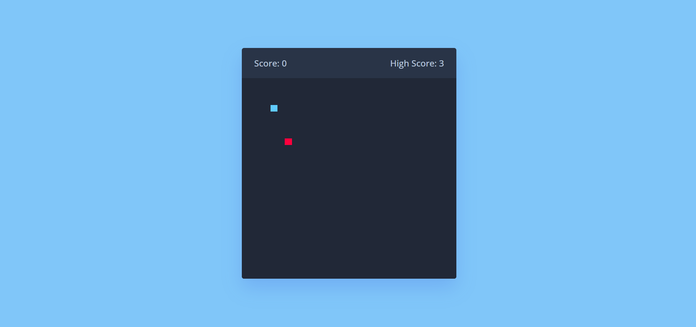
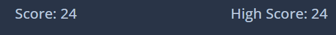

# Snake Game

Snake Game is a classic video game that dates back to the late 1970s. The objective of the game is for the player to control a snake, which grows in length as it eats food placed randomly on the screen. The player must avoid colliding with the walls or the snake's own body while navigating around the screen. As the game progresses, the snake moves faster, making it more difficult to control. The game ends when the snake collides with something, and the player's score is based on how many fruit the snake has eaten before its demise. The game has been adapted to various platforms and is still popular today.

# History

The first version of the Snake game was developed in the 1970s by a programmer named Gremlin. It became popular in arcades and on early home computer systems.

The concept of the game is simple, but it requires good hand-eye coordination and quick reflexes to be successful. As the snake grows longer, it becomes more difficult to avoid colliding with the walls or the snake's own body. This adds to the challenge of the game and keeps players engaged.

Over time, many variations of the Snake game have been developed, including versions with different graphics, power-ups, and obstacles. Some versions also allow for multiplayer gameplay, where multiple players can compete against each other to see who can survive the longest or score the highest number of points.

Today, the Snake game remains a classic and is still enjoyed by many casual gamers around the world. Its simple yet addictive gameplay continues to capture the attention of new generations of players.


## Run Locally

- Initialize the git

```bash
 git init
```

- Clone the rep

```bash
 git clone https://github.com/Souvik2376/Snake_Game.git
```

- Go to the project directory

```bash
  cd Snake-Game
```

- Run the Index.html


# Screenshots







# Live Site

[Play Game](https://souvik2376.github.io/Snake_Game/)

